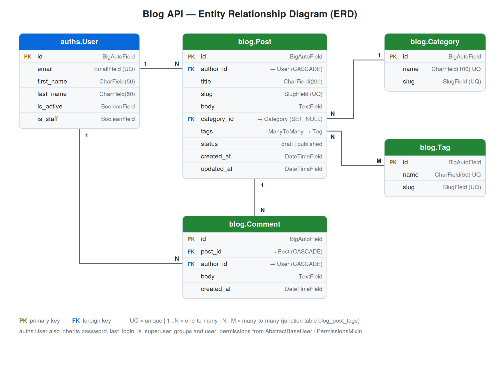

# Blog API

A blog REST API built with Django and Django REST Framework.
Homework 1 covers the project structure, configuration, the data model and the ERD.

## Tech stack

- Python 3.12+
- Django 5+, Django REST Framework
- python-decouple (configuration via `.env`)
- SQLite (local) / PostgreSQL (production)
- ruff (linting)

## Project structure

```
blog-api/
├── manage.py
├── requirements/
│   ├── base.txt          # shared dependencies
│   ├── dev.txt           # -r base.txt + dev tools (ruff)
│   └── prod.txt          # -r base.txt + gunicorn, psycopg2
├── logs/                 # log files (ignored by git)
├── docs/
│   ├── erd.png           # ERD image
│   └── erd.svg           # ERD source
├── apps/
│   ├── auths/            # custom user model (email login)
│   └── blog/             # categories, tags, posts, comments
└── settings/
    ├── .env              # secrets (never committed)
    ├── .env.example      # template for .env
    ├── conf.py           # reads .env via python-decouple
    ├── base.py           # shared settings
    ├── urls.py
    ├── wsgi.py
    ├── asgi.py
    └── env/
        ├── local.py      # DEBUG=True, SQLite
        └── prod.py       # DEBUG=False, PostgreSQL
```

Settings load order: `manage.py` → `settings/env/<BLOG_ENV_ID>.py` → `settings/base.py` → `settings/conf.py` → `settings/.env`.

## Getting started

```bash
git clone https://github.com/erasylmurat/blog-api.git
cd blog-api

python -m venv .venv
source .venv/bin/activate

pip install -r requirements/dev.txt

cp settings/.env.example settings/.env
# generate a secret key and put it into BLOG_SECRET_KEY:
python -c "import secrets; print(secrets.token_urlsafe(50))"

python manage.py migrate
python manage.py createsuperuser
python manage.py runserver
```

The admin site is available at http://127.0.0.1:8000/admin/.

## Environment variables

All variables are prefixed with `BLOG_` and read from `settings/.env`.

| Variable | Description | Default |
|---|---|---|
| `BLOG_SECRET_KEY` | Django secret key (required) | — |
| `BLOG_ENV_ID` | Environment: `local` or `prod` | `local` |
| `BLOG_ALLOWED_HOSTS` | Comma-separated list of allowed hosts | empty |
| `BLOG_DB_NAME` | PostgreSQL database name (prod) | `blog` |
| `BLOG_DB_USER` | PostgreSQL user (prod) | `postgres` |
| `BLOG_DB_PASSWORD` | PostgreSQL password (prod) | empty |
| `BLOG_DB_HOST` | PostgreSQL host (prod) | `localhost` |
| `BLOG_DB_PORT` | PostgreSQL port (prod) | `5432` |

For production set `BLOG_ENV_ID=prod` and install `requirements/prod.txt`.

## Data model



### auths

**User** — custom user model (`AbstractBaseUser` + `PermissionsMixin`), logs in with email.

| Field | Type |
|---|---|
| `email` | `EmailField`, unique, `USERNAME_FIELD` |
| `first_name` | `CharField(50)`, required |
| `last_name` | `CharField(50)`, required |
| `is_active` | `BooleanField`, default `True` |
| `is_staff` | `BooleanField`, default `False` |

The custom manager provides `create_user` and `create_superuser`, lowercases the email and hashes the password.

### blog

| Model | Fields |
|---|---|
| **Category** | `name` (unique, 100), `slug` (unique) |
| **Tag** | `name` (unique, 50), `slug` (unique) |
| **Post** | `author` (FK User, CASCADE), `title` (200), `slug` (unique), `body`, `category` (FK Category, SET_NULL, nullable), `tags` (M2M Tag), `status` (`draft` / `published`), `created_at`, `updated_at` |
| **Comment** | `post` (FK Post, CASCADE), `author` (FK User, CASCADE), `body`, `created_at` |

## Git workflow

- Each homework is done in its own branch (`hw1`, `hw2`, ...).
- When finished, the branch is merged into `main` and is **not** deleted.

## Code style

- PEP 8, checked with `ruff`: `ruff check .`
- No magic strings or numbers, constants are used instead.
- Imports order: standard library and third party, Django REST Framework, Django, local.
- Type hints for function arguments and return values.
